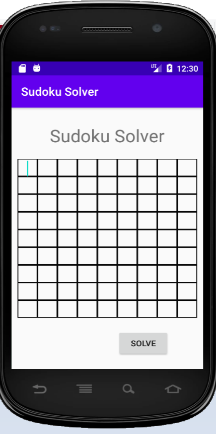

# SudokuSolver
A primitive Android App used to solve Sudoku from user's input

The main activty let the user inputs the sudoku.

When user opens the app, the first (main) activity seen by the user is this:

The TableLayout contains 9 TableRow, each containing 9 EditTexts representing a 9x9 Sudoku.
Users are then able to add their own Soduku table to be solved:

When the button is clicked, the app will try to solve the soduku. The class SudokuSolver creates an SudokuSolver object to solve the problem. The solving process is basically an use of backtracking algorithm in recursion. 

However, if the user's input is not a valid board (i.e: there are repeated numbers in the same row/column/square), error message is displayed:

Or, if the user accidentally input an invalid number (i.e: 0), an error message is also displayed:

If there is no error, the app will attempt to solve the sudoku. After solving, the user is directed to the second activity to display the answer. There will be text message to tell whether the sudoku is solvable or not.

